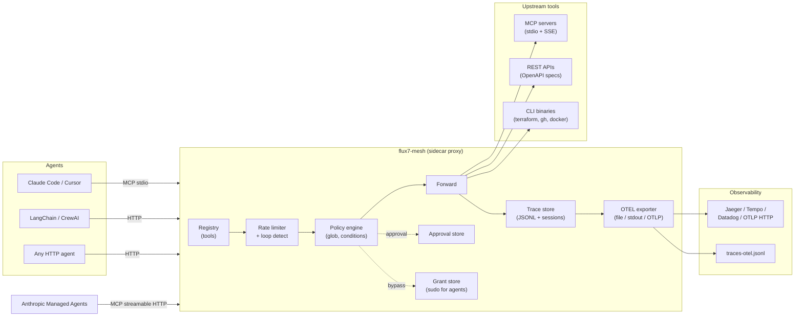

# flux7-mesh

[](https://github.com/KTCrisis/flux7-mesh/releases)
[](https://go.dev)
[](LICENSE)

**Guardrail for AI agents.**
Open-source sidecar proxy between AI agents and their tools — policy, human approval, and tracing without changing agent code.

One binary. One YAML config. Fail closed by default.

Works with Claude Code, Cursor, Anthropic Managed Agents, LangChain, CrewAI, or any agent that uses HTTP, MCP, or CLI tools.

## Table of contents

- [Architecture](#architecture)
- [Install](#install)
- [Quick start](#quick-start)
- [Config reference](#config-reference) — MCP servers, OpenAPI, CLI tools, policies, supervisor
- [Features](#features) — approval, grants, rate limiting, tracing, OTEL, supervisor
- [Commands & flags](#commands--flags)
- [API](#api)
- [Project structure](#project-structure)
- [Tests](#tests)
- [Roadmap](#roadmap)

## Architecture



**Import:** OpenAPI specs (URL or file) · MCP servers (stdio + SSE) · CLI binaries
**Export:** MCP server (stdio) · MCP Streamable HTTP (`POST /mcp`) · HTTP proxy (`:port`) · OTLP traces

## The problem

When you connect tools directly to an AI agent, the agent gets unguarded access — no policy, no trace, no control.

## The solution

Put Agent Mesh between the agent and its tools:

```bash
claude mcp add mesh7 -- mesh7 --mcp --config config.yaml
```

The agent sees a normal tool surface. Agent Mesh enforces policy and records traces on every call.

## Install

### Binary (recommended)

```bash
VERSION=$(curl -s https://api.github.com/repos/KTCrisis/flux7-mesh/releases/latest | grep tag_name | cut -d '"' -f4)

# Linux amd64
curl -L "https://github.com/KTCrisis/flux7-mesh/releases/download/${VERSION}/mesh7_${VERSION#v}_linux_amd64.tar.gz" | tar xz
sudo mv mesh7 /usr/local/bin/

# macOS Apple Silicon
curl -L "https://github.com/KTCrisis/flux7-mesh/releases/download/${VERSION}/mesh7_${VERSION#v}_darwin_arm64.tar.gz" | tar xz
sudo mv mesh7 /usr/local/bin/
```

All releases: [github.com/KTCrisis/flux7-mesh/releases](https://github.com/KTCrisis/flux7-mesh/releases)

### From source

Requires Go 1.24+:

```bash
git clone https://github.com/KTCrisis/flux7-mesh.git
cd flux7-mesh
make install    # builds to ~/go/bin/mesh7 with version metadata

mesh7 --version
# mesh7 v0.10.1 (827c457) built 2026-05-08T...
```

### Python SDK

```bash
pip install flux7-mesh              # core client
pip install flux7-mesh[anthropic]   # with Claude API support
```

Govern tool calls from any Python code — Claude API, LangChain, or plain HTTP:

```python
from mesh7 import GovernedToolkit

toolkit = GovernedToolkit(agent="my-agent")

@toolkit.tool
def get_weather(city: str) -> str:
    """Get current weather for a city."""
    return fetch_weather(city)

# Generate tools[] for Claude API
response = client.messages.create(
    model="claude-sonnet-4-6",
    tools=toolkit.schemas(),
    messages=[...],
)

# Execute with governance (policy + trace)
results = toolkit.process_response([b.model_dump() for b in response.content])
```

Or use the client directly:

```python
from mesh7 import AgentMesh

mesh = AgentMesh("http://localhost:9090", agent="my-agent")
decision = mesh.call_tool("filesystem.write_file", {"path": "/tmp/x", "content": "hello"})
print(decision.action)  # allow | deny | human_approval
```

See [sdk/python/](sdk/python/) for full docs and examples.

## Quick start

### 1. Write a config

```yaml
# config.yaml
mcp_servers:
  - name: filesystem
    transport: stdio
    command: npx
    args: ["-y", "@modelcontextprotocol/server-filesystem", "/home/me/projects"]

policies:
  - name: claude
    agent: "claude"
    rules:
      - tools: ["filesystem.read_*", "filesystem.list_*", "filesystem.search_*"]
        action: allow
      - tools: ["filesystem.write_file", "filesystem.edit_file"]
        action: human_approval
      - tools: ["filesystem.*"]
        action: deny

  - name: default
    agent: "*"
    rules:
      - tools: ["*"]
        action: deny
```

Or auto-generate one:

```bash
mesh7 discover --config config.yaml --generate-policy
mesh7 discover --openapi https://petstore.swagger.io/v2/swagger.json --generate-policy
```

### 2. Plug into Claude Code

```bash
claude mcp add mesh7 -- mesh7 --mcp --config config.yaml
```

### 3. Use normally

Restart Claude Code. The agent sees the tools. Agent Mesh enforces the rules. Every call is traced.

---

## Config reference

All features are declared in a single YAML config.

### MCP servers

```yaml
mcp_servers:
  - name: filesystem
    transport: stdio
    command: npx
    args: ["-y", "@modelcontextprotocol/server-filesystem", "/home/me"]

  - name: remote-service
    transport: sse
    url: "https://mcp-server.example.com/sse"
    headers:
      Authorization: "Bearer <token>"
```

### OpenAPI specs

Import REST APIs as governed tools — persisted across restarts.

```yaml
openapi:
  # From URL
  - url: https://date.nager.at/swagger/v3/swagger.json

  # From local file
  - file: ./specs/internal-api.json
    backend_url: http://localhost:3001
```

Each endpoint becomes a tool (e.g. `get_public_holidays`). Same policy, same traces as MCP tools.

### CLI tools

Wrap any CLI binary behind policy, approval, and tracing:

```yaml
cli_tools:
  - name: gh
    bin: gh
    default_action: allow

  - name: terraform
    bin: terraform
    default_action: human_approval
    commands:
      plan:
        timeout: 120s

  - name: kubectl
    bin: kubectl
    strict: true      # only declared commands, everything else denied
    commands:
      get:
        allowed_args: ["-n", "--namespace", "-o"]
```

Agents call CLI tools like any MCP tool — `terraform.plan`, `kubectl.get`, `gh.pr`. See [docs/cli-tools.md](docs/cli-tools.md).

### Policies

YAML-based, first-match-wins, glob patterns for agents and tools.

```yaml
policies:
  - name: support-agent
    agent: "support-*"
    rate_limit:
      max_per_minute: 30
      max_total: 1000
    rules:
      - tools: ["*.read_*", "*.list_*", "*.get_*"]
        action: allow
      - tools: ["create_refund"]
        action: allow
        condition:
          field: "params.amount"
          operator: "<"
          value: 500
      - tools: ["*"]
        action: deny
```

| Action | Behavior |
|--------|----------|
| `allow` | Forward to backend, return result |
| `deny` | Block the call, return denial |
| `human_approval` | Require human approval before forwarding |

**Fail closed:** no matching rule = deny.

### Per-agent policy files

One file per agent, drop-in/drop-out:

```yaml
# config.yaml
policy_dir: ./policies   # load all *.yaml from this directory
```

```yaml
# policies/scout7.yaml
name: scout7
agent: "scout7"
rate_limit:
  max_per_minute: 30
rules:
  - tools: ["searxng.*", "fetch.*", "ollama.*", "memory.*"]
    action: allow
  - tools: ["*"]
    action: deny
```

Files are loaded alphabetically after inline `policies:`. Duplicate names produce an error.

### Supervisor mode

```yaml
supervisor:
  enabled: true          # hide approval tools from agents
  expose_content: false  # redact raw params → structural metadata
  supervisor_agents:     # agent IDs (glob) allowed to see approval tools
    - "supervisor-*"
```

When enabled, `approval.resolve` and `approval.pending` are hidden from agents — only an external supervisor can resolve approvals. See [docs/supervisor-protocol.md](docs/supervisor-protocol.md).

Agents matching `supervisor_agents` globs are whitelisted: they see and can call approval tools even in supervisor mode. This enables a Managed Agent (e.g. Claude via MCP Streamable HTTP) to act as a cloud supervisor — connecting to `POST /mcp` with `Authorization: Bearer agent:supervisor-claude` and resolving approvals with Claude's judgment.

### Memory integration

Persist approval decisions as queryable facts in [mem7](https://github.com/KTCrisis/flux7-memory). Fire-and-forget — a failing mem7 never blocks approvals.

```yaml
memory:
  url: http://localhost:9070    # mem7 daemon URL
  token: ""                     # optional Bearer token
```

When configured, every approval resolve (approve, deny, timeout) is written to mem7 as a fact with tags `[decision, approved|denied, <tool>, agent:<id>]`.

**Auto-approve from past decisions** — when `memory.url` is set, mesh7 queries mem7 before submitting to the approval queue. If a tool+agent pattern has 3+ consistent approvals with 0 rejections, it is auto-approved (traced as `supervisor:mem7`). Governance gets less intrusive over time without getting less safe.

```yaml
supervisor:
  auto_approve: true     # default true when memory.url is set
  min_approvals: 3       # threshold for auto-approve (default 3)
```

The auto-approve is a pre-filter (Level 1). If it can't resolve, the request proceeds to the external supervisor (if running) or human. If mem7 is down, the request is escalated — never blocked. See [docs/mem7-auto-approve.md](docs/mem7-auto-approve.md) for a step-by-step example.

### Other settings

```yaml
port: 9090                                   # HTTP port (default 9090)
storage_path: state.db                       # SQLite durable state (approvals, grants survive restarts)
trace_file: traces.jsonl                     # JSONL persistence
otel_endpoint: /path/to/traces-otel.jsonl    # or "stdout" or "http://localhost:4318"
approval:
  timeout_seconds: 300                       # approval TTL (default 5 min)
  notify_url: https://hooks.slack.com/...    # webhook on new pending approval
```

---

## Features

### Human approval

When a policy requires `human_approval`, the flow is non-blocking:

```
Claude calls filesystem.write_file
  → mesh7 returns: "Approval required (id: a1b2c3d4)"
  → Claude calls approval.resolve(id: a1b2c3d4, decision: approve)
  → mesh7 replays the original tool call
  → Result returned to Claude
```

Virtual MCP tools: `approval.resolve`, `approval.pending`.
Also via CLI (`mesh approve <id>`) or HTTP API (`POST /approvals/{id}/approve`).

### Temporal grants

Like `sudo` for agents — temporary override for repeated approvals:

```
"Grant filesystem.write_* for 30 minutes"
→ grant.create {tools: "filesystem.write_*", duration: "30m"}
→ All filesystem.write_* calls bypass approval for 30m
→ Traced as "grant:a1b2c3d4"
```

Virtual MCP tools: `grant.create`, `grant.list`, `grant.revoke`.

Grants only bypass `human_approval`. Tools marked `deny` remain blocked — policy edit required.

### Rate limiting

Per-agent call limits with automatic loop detection:

| Protection | What it stops |
|------------|--------------|
| `max_per_minute` | Runaway loops |
| `max_total` | Budget exhaustion |
| Loop detection | Same tool + same params > 3x in 10s |

### Tracing & sessions

Every tool call is logged: agent, tool, params, policy decision, latency, approval metadata.

```bash
curl http://localhost:9090/traces?agent=claude&tool=filesystem.write_file
curl http://localhost:9090/sessions          # list sessions
curl http://localhost:9090/sessions/abc123   # session detail
```

Session IDs are propagated via `X-Session-Id` header or `--mcp-session-id` flag.

### OpenTelemetry export

```yaml
otel_endpoint: /path/to/traces-otel.jsonl   # file
otel_endpoint: stdout                        # debug
otel_endpoint: http://localhost:4318         # Jaeger, Tempo, Datadog
```

Each span includes `agent.id`, `tool.name`, `policy.action`, `approval.*`, and `llm.token.*` attributes. See [docs/otel.md](docs/otel.md).

### Supervisor protocol

External supervisor agents can poll `GET /approvals?status=pending`, evaluate with full context (recent traces, active grants, injection risk), and resolve with structured verdicts (reasoning, confidence). See [docs/supervisor-protocol.md](docs/supervisor-protocol.md).

---

## Commands & flags

### `mesh7` (main binary)

```bash
mesh7 [flags]                           # run proxy (HTTP or MCP mode)
mesh7 serve [flags]                     # run as persistent daemon
mesh7 discover [flags]                       # discover tools + generate policy
mesh7 --version                         # print version
```

| Flag | Default | Description |
|------|---------|-------------|
| `--config` | `config.yaml` | Path to YAML config |
| `--openapi` | | OpenAPI spec URL (ephemeral, for quick tests) |
| `--backend` | | Backend base URL override |
| `--port` | from config or `9090` | Port override |
| `--mcp` | `false` | MCP mode (stdio JSON-RPC — auto-proxies to daemon if running) |
| `--mcp-agent` | `claude` | Agent ID for MCP-mode policy evaluation |
| `--mcp-session-id` | auto-generated | Session ID for MCP traces |

`serve` flags: `--config <path>`, `--port <port>`. Runs as a persistent HTTP daemon. MCP clients auto-proxy to it via `--mcp`.

`discover` flags: `--openapi <url>`, `--config <path>`, `--generate-policy`, `--backend <url>`.

### `mesh` (approval CLI)

```bash
mesh pending                    # list pending approvals
mesh show <id>                  # full details
mesh approve <id>               # approve
mesh deny <id>                  # deny
mesh watch                      # interactive poll + prompt
```

Set `MESH_URL` to override the default `http://localhost:9090`.

---

## API

| Method | Path | Description |
|--------|------|-------------|
| `POST` | `/decide` | Evaluate policy without executing (returns allow/deny/human_approval) |
| `POST` | `/tool/{name}` | Proxy a tool call through policy |
| `POST` | `/mcp` | MCP Streamable HTTP transport (JSON-RPC) |
| `DELETE` | `/mcp` | Terminate MCP HTTP session |
| `GET` | `/tools` | List all registered tools |
| `GET` | `/mcp-servers` | List connected MCP servers |
| `GET` | `/traces` | Query traces (`?agent=...&tool=...`) |
| `GET` | `/sessions` | List sessions (id, agent, event count, timespan) |
| `GET` | `/sessions/{id}` | Session detail |
| `GET` | `/otel-traces` | OTLP JSON spans (`?agent=...&tool=...&limit=...`) |
| `GET` | `/approvals` | List approvals (`?status=pending&tool=filesystem.*`) |
| `GET` | `/approvals/{id}` | Approval detail with context |
| `POST` | `/approvals/{id}/approve` | Approve (optional: reasoning, confidence) |
| `POST` | `/approvals/{id}/deny` | Deny (optional: reasoning, confidence) |
| `GET` | `/grants` | List active grants |
| `POST` | `/grants` | Create a grant |
| `DELETE` | `/grants/{id}` | Revoke a grant |
| `GET` | `/health` | Health check and stats |
| `GET` | `/version` | Version info |

---

## Project structure

```
flux7-mesh/
├── cmd/
│   ├── mesh7/        # Main binary (entry point, wiring)
│   └── mesh/              # Approval CLI (pending/approve/deny/watch)
├── config/                # YAML config parsing + validation
├── registry/              # Tool registry (OpenAPI + MCP + CLI imports)
├── policy/                # Rule evaluation (globs, conditions, fail-closed)
├── proxy/                 # HTTP handler (auth → rate limit → policy → forward → trace)
├── mcp/                   # MCP client/server/transport (stdio + SSE + streamable HTTP)
├── approval/              # Channel-based approval store with timeout
├── grant/                 # Temporal grants (TTL-based sudo)
├── storage/               # SQLite durable state (approvals, grants survive restarts)
├── ratelimit/             # Sliding window + loop detection
├── supervisor/            # Content isolation + injection detection
├── exec/                  # Secure CLI execution (no shell, arg validation)
├── trace/                 # In-memory + JSONL + OTEL export
├── policies/              # Per-agent policy files (used with policy_dir)
├── sdk/python/            # Python SDK (pip install flux7-mesh)
├── examples/              # Example configs (filesystem, petstore, travel, langchain)
└── docs/                  # CLI tools guide, OTEL guide, supervisor protocol
```

## Tests

```bash
go test ./...              # all tests
go test ./... -race        # with race detector
```

260 Go tests across 15 packages + 29 Python SDK tests, covering config parsing, policy evaluation, HTTP/MCP proxy flows, approval lifecycle, mem7 auto-approve, supervisor agent whitelist, CLI execution security, rate limiting, tracing, OTEL export, supervisor content isolation, injection detection, durable state persistence, and auto-proxy daemon detection.

## Roadmap

- [x] Import OpenAPI (URL + file), MCP (stdio + SSE), CLI binaries
- [x] Policy engine with glob patterns + conditions
- [x] Human approval (non-blocking, virtual MCP tools, CLI, HTTP)
- [x] Temporal grants (sudo for agents)
- [x] Rate limiting + loop detection
- [x] Trace store + JSONL + OTEL export
- [x] Per-agent policy files + specificity sort
- [x] Session tracking
- [x] Supervisor protocol (content isolation, injection detection)
- [x] CLI tool governance (3 modes, secure exec)
- [x] OpenAPI config field (persistent import)
- [x] Dashboard UI (via [flux7-console](https://github.com/KTCrisis/flux7-console))
- [x] Decision persistence (approval decisions written to [mem7](https://github.com/KTCrisis/flux7-memory) as queryable facts)
- [x] Auto-approve from mem7 (built-in Level 1 supervisor — queries past decisions, auto-approves routine patterns)
- [x] MCP Streamable HTTP transport (`POST /mcp` — connects Anthropic Managed Agents, any remote MCP client)
- [x] Durable state (approvals, grants persisted in SQLite — survives restarts)
- [x] Auto-proxy (in `--mcp` mode, detects running daemon on configured port — becomes thin stdio→HTTP proxy, zero config change)
- [x] `mesh7 serve` daemon mode (persistent, multi-client, auto-proxy connects seamlessly)
- [x] Python SDK (`pip install flux7-mesh` — GovernedToolkit for Claude API tool_use, direct HTTP client)
- [ ] Operator auth (separate identity from agent Bearer)
- [ ] Session log durable + `wake(sessionId)` recovery
- [x] Policy hot-reload (fsnotify, debounce 200ms, config + policy_dir)
- [ ] Condition engine v2 (AND/OR/nested)

## Why "Agent Mesh"

The same way Envoy sits between microservices and adds observability, auth, and rate limiting without changing service code — Agent Mesh sits between AI agents and their tools.

Agents don't know the proxy exists. They call tools, get results. The governance layer is invisible to the agent, visible to the operator.

## License

Apache 2.0
