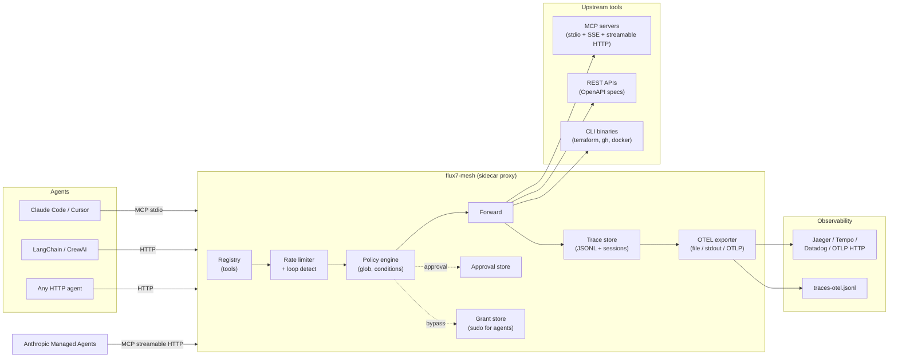

```
   ______ ____                  __ 
  / __/ //_  /_____ _  ___ ___ / / 
 / _// /__/ /___/  ' \/ -_|_-</ _ \
/_/ /____/_/   /_/_/_/\__/___/_//_/
```

# flux7-mesh

[](https://github.com/KTCrisis/flux7-mesh/releases)
[](https://github.com/KTCrisis/flux7-mesh/actions/workflows/ci.yaml)
[](https://go.dev)
[](LICENSE)

**Guardrail for AI agents.**
Open-source sidecar proxy between AI agents and their tools — policy, human approval, and tracing without changing agent code.

One binary. One YAML config. Fail closed by default.

Works with Claude Code, Cursor, Anthropic Managed Agents, LangChain, CrewAI, or any agent that uses HTTP, MCP, or CLI tools.

## Table of contents

- [Architecture](#architecture)
- [Install](#install)
- [Quick start](#quick-start)
- [Features](#features) — approval, grants, rate limiting, tracing, OTEL, supervisor
- [Documentation](#documentation)
- [Roadmap](#roadmap)

## Architecture


```mermaid
flowchart LR
    subgraph Agents["Agents"]
        A1["Claude Code / Cursor"]
        A2["LangChain / CrewAI"]
        A3["Any HTTP agent"]
    end

    subgraph Mesh["flux7-mesh (sidecar proxy)"]
        direction TB
        REG["Registry<br/>(tools)"]
        RL["Rate limiter<br/>+ loop detect"]
        POL["Policy engine<br/>(glob, conditions)"]
        FWD["Forward"]
        APP["Approval store"]
        GRT["Grant store<br/>(sudo for agents)"]
        TRC["Trace store<br/>(JSONL + sessions)"]
        OTEL["OTEL exporter<br/>(file / stdout / OTLP)"]

        REG --> RL --> POL --> FWD
        POL -.approval.-> APP
        POL -.bypass.-> GRT
        FWD --> TRC
        TRC --> OTEL
    end

    subgraph Upstream["Upstream tools"]
        U1["MCP servers<br/>(stdio + SSE + streamable HTTP)"]
        U2["REST APIs<br/>(OpenAPI specs)"]
        U3["CLI binaries<br/>(terraform, gh, docker)"]
    end

    subgraph Observability["Observability"]
        O1["Jaeger / Tempo /<br/>Datadog / OTLP HTTP"]
        O2["traces-otel.jsonl"]
    end

    A4["Anthropic Managed Agents"]

    A1 -- "MCP stdio" --> Mesh
    A2 -- HTTP --> Mesh
    A3 -- HTTP --> Mesh
    A4 -- "MCP streamable HTTP" --> Mesh

    FWD --> U1
    FWD --> U2
    FWD --> U3

    OTEL --> O1
    OTEL --> O2
```

**Import:** OpenAPI specs (URL or file) · MCP servers (stdio + SSE + streamable HTTP) · CLI binaries
**Export:** MCP server (stdio) · MCP Streamable HTTP (`POST /mcp`) · HTTP proxy (`:port`) · OTLP traces

## The problem

When you connect tools directly to an AI agent, the agent gets unguarded access — no policy, no trace, no control.

## The solution

Put flux7-mesh between the agent and its tools:

```bash
claude mcp add mesh7 -- mesh7 --mcp --config config.yaml
```

The agent sees a normal tool surface. flux7-mesh enforces policy and records traces on every call.

## Install

### Binary (recommended)

```bash
VERSION=$(curl -s https://api.github.com/repos/KTCrisis/flux7-mesh/releases/latest | grep tag_name | cut -d '"' -f4)

# Linux amd64
curl -L "https://github.com/KTCrisis/flux7-mesh/releases/download/${VERSION}/mesh7_${VERSION#v}_linux_amd64.tar.gz" | tar xz
sudo mv mesh7 /usr/local/bin/

# macOS Apple Silicon
curl -L "https://github.com/KTCrisis/flux7-mesh/releases/download/${VERSION}/mesh7_${VERSION#v}_darwin_arm64.tar.gz" | tar xz
sudo mv mesh7 /usr/local/bin/
```

All releases: [github.com/KTCrisis/flux7-mesh/releases](https://github.com/KTCrisis/flux7-mesh/releases)

### From source

Requires Go 1.24+:

```bash
git clone https://github.com/KTCrisis/flux7-mesh.git
cd flux7-mesh
make install    # builds to ~/go/bin/mesh7 with version metadata

mesh7 --version
# mesh7 v0.10.1 (827c457) built 2026-05-08T...
```

### Python SDK, Agent SDK hooks, harness hook

`pip install flux7-mesh` governs tool calls from Python (Claude API, Agent SDK, LangChain, plain HTTP), and ships the `PreToolUse` hook that governs what the harness runs itself. See [Python SDK](https://docs.flux7.art/mesh7/python-sdk/).

## Quick start

### 1. Write a config

```yaml
# config.yaml
mcp_servers:
  - name: filesystem
    transport: stdio
    command: npx
    args: ["-y", "@modelcontextprotocol/server-filesystem", "/home/me/projects"]

policies:
  - name: claude
    agent: "claude"
    rules:
      - tools: ["filesystem.read_*", "filesystem.list_*", "filesystem.search_*"]
        action: allow
      - tools: ["filesystem.write_file", "filesystem.edit_file"]
        action: human_approval
      - tools: ["filesystem.*"]
        action: deny

  - name: default
    agent: "*"
    rules:
      - tools: ["*"]
        action: deny
```

Or auto-generate one:

```bash
mesh7 discover --config config.yaml --generate-policy
mesh7 discover --openapi https://petstore.swagger.io/v2/swagger.json --generate-policy
```

### 2. Plug into Claude Code

```bash
claude mcp add mesh7 -- mesh7 --mcp --config config.yaml
```

### 3. Use normally

Restart Claude Code. The agent sees the tools. flux7-mesh enforces the rules. Every call is traced.

---

## Features

### Human approval

When a policy requires `human_approval`, the flow is non-blocking:

```
Claude calls filesystem.write_file
  → mesh7 returns: "Approval required (id: a1b2c3d4)"
  → Claude calls approval.resolve(id: a1b2c3d4, decision: approve)
  → mesh7 replays the original tool call
  → Result returned to Claude
```

Virtual MCP tools: `approval.resolve`, `approval.pending`.
Also via CLI (`mesh approve <id>`) or HTTP API (`POST /approvals/{id}/approve`).

### Temporal grants

Like `sudo` for agents — temporary override for repeated approvals:

```
"Grant filesystem.write_* for 30 minutes"
→ grant.create {tools: "filesystem.write_*", duration: "30m"}
→ All filesystem.write_* calls bypass approval for 30m
→ Traced as "grant:a1b2c3d4"
```

Virtual MCP tools: `grant.create`, `grant.list`, `grant.revoke`.

Grants only bypass `human_approval`. Tools marked `deny` remain blocked — policy edit required.

### Rate limiting

Per-agent call limits with automatic loop detection:

| Protection | What it stops |
|------------|--------------|
| `max_per_minute` | Runaway loops |
| `max_total` | Budget exhaustion |
| Loop detection | Same tool + same params > 3x in 10s |

### Tracing & sessions

Every tool call is logged: agent, tool, params, policy decision, latency, approval metadata.

```bash
curl http://localhost:9090/traces?agent=claude&tool=filesystem.write_file
curl http://localhost:9090/sessions          # list sessions
curl http://localhost:9090/sessions/abc123   # session detail
```

Session IDs are propagated via `X-Session-Id` header or `--mcp-session-id` flag.

### OpenTelemetry export

```yaml
otel_endpoint: /path/to/traces-otel.jsonl   # file
otel_endpoint: stdout                        # debug
otel_endpoint: http://localhost:4318         # Jaeger, Tempo, Datadog
```

Each span includes `agent.id`, `tool.name`, `policy.action`, `approval.*`, and `llm.token.*` attributes. See [docs/otel.md](docs/otel.md).

### Supervisor protocol

External supervisor agents can poll `GET /approvals?status=pending`, evaluate with full context (recent traces, active grants, injection risk), and resolve with structured verdicts (reasoning, confidence). See [docs/supervisor-protocol.md](docs/supervisor-protocol.md).

---

## Documentation

The full reference lives at [docs.flux7.art/mesh7](https://docs.flux7.art/mesh7/):

- [Configuration](https://docs.flux7.art/mesh7/configuration/) — every YAML key: MCP servers, OpenAPI, CLI tools, policies, supervisor, memory, auth
- [Writing policies](https://docs.flux7.art/mesh7/writing-policies/) · [JWT authentication](https://docs.flux7.art/mesh7/jwt-auth/) · [Control-plane auth](https://docs.flux7.art/mesh7/control-plane-auth/)
- [Approval flow](https://docs.flux7.art/mesh7/approval-flow/) · [CLI tools](https://docs.flux7.art/mesh7/cli-tools/) · [Supervisor protocol](https://docs.flux7.art/mesh7/supervisor-protocol/)
- [Deployment modes](https://docs.flux7.art/mesh7/deployment-modes/) · [Observability](https://docs.flux7.art/mesh7/otel/)
- [Reference](https://docs.flux7.art/mesh7/reference/) — commands, flags, HTTP API, project structure, tests

## Roadmap

### Next

Where the product is going, in the order it will land.

1. **Policy on the delegation, not only the agent.** A validated token can now carry the human an agent acts for (`auth.jwt.user_claim`, recorded on every trace as `user_id`). The next step is rules that decide on the *pair*: this agent, for this user, may call this tool. Gateways decide who may reach a door; this decides what a given actor may do once inside.
2. **Condition engine v2** — AND/OR/nested conditions, and claim-based conditions (role, scope from the token) in YAML rules. The substrate for the item above.
3. **Semantic policy on content.** Rules that act on what a call carries, not only on the tool's name: "this argument contains an IBAN", "this result contains an injected instruction". A small local classifier annotates the request; the existing condition engine decides. Tool *results* first — indirect injection is the agentic risk nobody upstream can see.
4. Operator auth (an identity distinct from the agent Bearer) and a durable session log with `wake(sessionId)` recovery.

### Shipped

- Import: OpenAPI (URL + file), MCP (stdio + SSE + streamable HTTP), CLI binaries; persistent `openapi:` config field
- Export: MCP server (stdio), MCP Streamable HTTP (`POST /mcp` — Anthropic Managed Agents, any remote MCP client), HTTP proxy, OTLP traces
- Policy engine: glob patterns, conditions on arguments, per-agent policy files, specificity sort, hot-reload
- Human approval (non-blocking, virtual MCP tools, CLI, HTTP) and temporal grants (sudo for agents)
- Rate limiting and loop detection
- Trace store with JSONL persistence, sessions, grant lineage, OTEL export
- Supervisor protocol: content isolation, injection detection
- CLI tool governance (3 modes, secure exec)
- JWT identity against an external IdP; session bound to the caller's identity on every request
- Durable state (approvals, grants in SQLite); `mesh7 serve` daemon with auto-proxy
- Decision persistence and auto-approve via [mem7](https://github.com/KTCrisis/flux7-memory); dashboard via [flux7-console](https://github.com/KTCrisis/flux7-console)
- Python SDK (`pip install flux7-mesh`): GovernedToolkit, MeshHooks, harness hook

## Why a mesh

The same way Envoy sits between microservices and adds observability, auth, and rate limiting without changing service code — flux7-mesh sits between AI agents and their tools.

Agents don't know the proxy exists. They call tools, get results. The governance layer is invisible to the agent, visible to the operator.

## License

Apache 2.0
