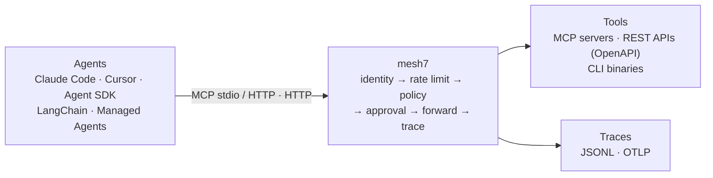

```
┌┬┐┌─┐┌─┐┬ ┬┌─┐
│││├┤ └─┐├─┤  │   agents ──▶ mesh7 ──▶ tools
┴ ┴└─┘└─┘┴ ┴  ┴   policy · approval · trace
```

# flux7-mesh

[](https://github.com/KTCrisis/flux7-mesh/releases)
[](https://github.com/KTCrisis/flux7-mesh/actions/workflows/ci.yaml)
[](https://go.dev)
[](LICENSE)

**A governance proxy between AI agents and their tools.** Policy, human approval and signed traces on every tool call, without changing agent code.

One Go binary, one YAML file, fail closed. Works with Claude Code, Cursor, Anthropic Managed Agents, the Agent SDK, LangChain, or anything that calls tools over MCP, HTTP or a CLI.

Full documentation: **[docs.flux7.art/mesh7](https://docs.flux7.art/mesh7/)**

## What it does

| | |
|---|---|
| **Policy** | Allow, deny or ask, per agent and per tool: globs, conditions on arguments, per-agent files, hot reload. [Writing policies](https://docs.flux7.art/mesh7/writing-policies/) |
| **Human approval** | A call that needs a human waits in a queue (terminal, CLI, HTTP, [console](https://github.com/KTCrisis/flux7-console)); time-boxed grants act as `sudo` for agents. [Approval flow](https://docs.flux7.art/mesh7/approval-flow/) |
| **Emergency stop** | Stop every call of one agent, one session or everything at once; pending approvals are denied, grants revoked and put back on resume. CLI, HTTP and console. [Emergency stop](https://docs.flux7.art/mesh7/emergency-stop/) |
| **Traces** | Every call and decision, grouped by session, HMAC hash-chained and verifiable, exported over OTLP. [Trace integrity](https://docs.flux7.art/mesh7/trace-integrity/) · [Observability](https://docs.flux7.art/mesh7/otel/) |
| **Tool catalogue** | Each tool classified (named or generic, read or write) from what it declares; a draft policy from `discover`; per-agent decisions; one tool's action changed from the control plane. Opt-in: pin upstream catalogues against silent changes, hide what can only be denied. [Tool classification](https://docs.flux7.art/mesh7/tool-classification/) |
| **Identity** | JWT from your IdP, including the human an agent acts for. [JWT authentication](https://docs.flux7.art/mesh7/jwt-auth/) |
| **Delegation** | Past decisions auto-approve through [flux7-memory](https://github.com/KTCrisis/flux7-memory); an L1 supervisor resolves the rest through [flux7-supervisor](https://github.com/KTCrisis/flux7-supervisor). [Memory integration](https://docs.flux7.art/mesh7/mem7-auto-approve/) |
| **Provenance** | Every call to an MCP upstream carries its trace in `_meta`, and the authenticated agent for upstreams that opt in (`forward_identity`): mem7 signs, chains and scopes memories with them. `GET /traces?trace=<id>` follows a memory back to its call. [mem7 provenance](https://docs.flux7.art/mem7/provenance-scopes/) |

## How it sits


```mermaid
flowchart LR
    A["Agents<br/>Claude Code · Cursor · Agent SDK<br/>LangChain · Managed Agents"]
    M["mesh7<br/>identity → rate limit → policy<br/>→ approval → forward → trace"]
    T["Tools<br/>MCP servers · REST APIs (OpenAPI)<br/>CLI binaries"]
    O["Traces<br/>JSONL · OTLP"]
    A -- "MCP stdio / HTTP · HTTP" --> M --> T
    M --> O
```

Agents see an ordinary tool surface. The operator sees every decision.

## Install

```bash
curl -fsSL https://raw.githubusercontent.com/KTCrisis/flux7-mesh/main/install.sh | sh
```

Installs `mesh7` (the proxy) and `mesh` (the approval CLI) in `~/.local/bin`. Add `-s -- --service` to also run mesh7 as a systemd user service, or `--system` where the user manager is unavailable (some WSL setups). By hand:

```bash
curl -L https://github.com/KTCrisis/flux7-mesh/releases/latest/download/mesh7_linux_amd64.tar.gz | tar xz
sudo mv mesh7 mesh /usr/local/bin/
```

Other targets: `mesh7_darwin_arm64.tar.gz`, `mesh7_linux_arm64.tar.gz`, `mesh7_windows_amd64.zip`… ([releases](https://github.com/KTCrisis/flux7-mesh/releases)). From source (Go 1.24+): `make install`. Python SDK and the Claude Code harness hook: `pip install flux7-mesh` ([Python SDK](https://docs.flux7.art/mesh7/python-sdk/)).

## Quick start

```yaml
# config.yaml
mcp_servers:
  - name: filesystem
    transport: stdio
    command: npx
    args: ["-y", "@modelcontextprotocol/server-filesystem", "/home/me/projects"]

policies:
  - name: claude
    agent: "claude"
    rules:
      - tools: ["filesystem.read_*", "filesystem.list_*"]
        action: allow
      - tools: ["filesystem.write_file", "filesystem.edit_file"]
        action: human_approval
  - name: default
    agent: "*"
    rules:
      - tools: ["*"]
        action: deny
```

```bash
mesh7 discover --config config.yaml --generate-policy   # or start from a commented draft
claude mcp add mesh7 -- mesh7 --mcp --config config.yaml
```

Restart Claude Code: the tools are there, the rules apply, every call is traced. When a call needs approval, the agent relays an id: run `mesh approve <id>` (or use the [console](https://github.com/KTCrisis/flux7-console)), and its retry of the same call goes through. For a long-running daemon, OpenAPI and CLI sources, and every YAML key, see [Getting started](https://docs.flux7.art/mesh7/getting-started/) and [Configuration](https://docs.flux7.art/mesh7/configuration/).

## Documentation

- [Configuration](https://docs.flux7.art/mesh7/configuration/) · [Writing policies](https://docs.flux7.art/mesh7/writing-policies/) · [Tool classification](https://docs.flux7.art/mesh7/tool-classification/)
- [Approval flow](https://docs.flux7.art/mesh7/approval-flow/) · [CLI tools](https://docs.flux7.art/mesh7/cli-tools/) · [Supervisor protocol](https://docs.flux7.art/mesh7/supervisor-protocol/)
- [JWT authentication](https://docs.flux7.art/mesh7/jwt-auth/) · [Control-plane auth](https://docs.flux7.art/mesh7/control-plane-auth/) · [Agent security](https://docs.flux7.art/mesh7/security/)
- [Trace integrity](https://docs.flux7.art/mesh7/trace-integrity/) · [Observability](https://docs.flux7.art/mesh7/otel/) · [Deployment modes](https://docs.flux7.art/mesh7/deployment-modes/)
- [Reference](https://docs.flux7.art/mesh7/reference/): commands, flags, HTTP API, project layout, tests

## Next

1. **Policy on the delegation**: rules on the pair *this agent, for this user*, from the identity the token already carries.
2. **Conditions v2**: AND/OR, claims from the token, parsed arguments instead of text matching.
3. **Policy on content**: a local classifier annotates arguments and results (indirect injection first); the condition engine decides.

Shipped features are listed per version in the [releases](https://github.com/KTCrisis/flux7-mesh/releases).

## Why a mesh

Envoy sits between services and adds identity, policy and telemetry without changing their code. mesh7 does the same between agents and their tools: invisible to the agent, visible to the operator.

## License

Apache 2.0
